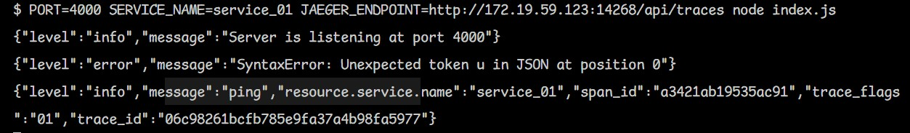
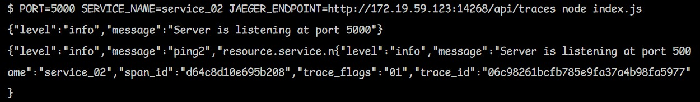
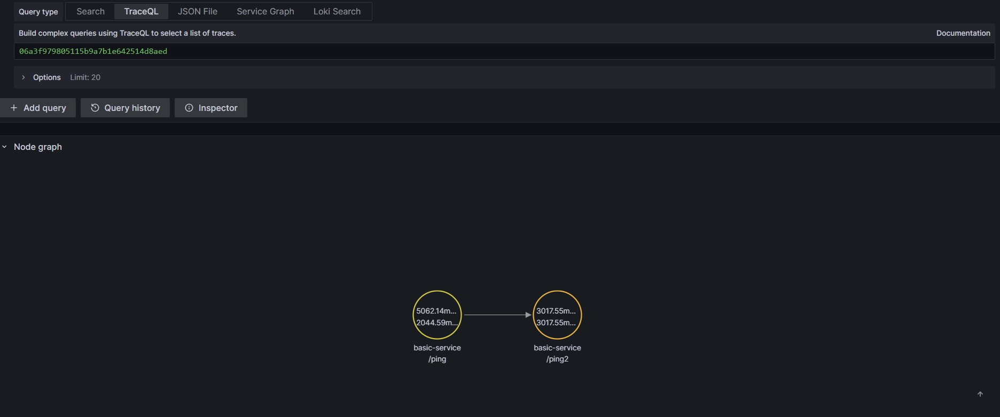
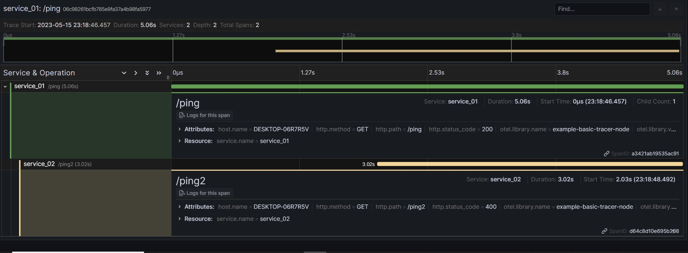

# Introduction

Demonstrate distributed tracing based on [opentelemetry](https://opentelemetry.io/docs/) under microservice-based architecture

---

```sh
PORT=4000 SERVICE_NAME=service_01 JAEGER_ENDPOINT=http://172.19.59.123:14268/api/traces node index.js
PORT=5000 SERVICE_NAME=service_02 JAEGER_ENDPOINT=http://172.19.59.123:14268/api/traces node index.js
```

---

# Demo





