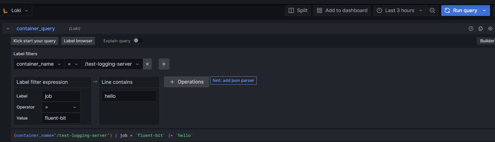
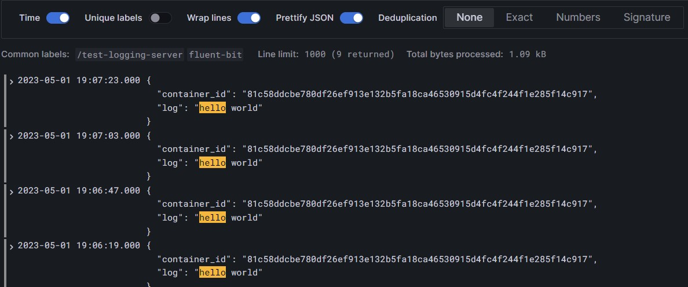

# LogQL - the Loki query language

## Label matching operators

| Operator | Action             |
| -------- | ------------------ |
| \=       | exactly equal      |
| !=       | not equal          |
| \=~      | regex-match        |
| !~       | do not regex-match |

## Line filtering operators

| Operator | Action                                 |
| -------- | -------------------------------------- |
| \|=      | line contains string                   |
| !=       | line does not contain string           |
| \|~      | line matches regular expression        |
| !~       | line does not match regular expression |

## Demo

## Reference

- [Docker centralized logging using Fluent Bit, Grafana and Loki](https://medium.com/@thakkaryash94/docker-centralized-logging-using-fluent-bit-grafana-and-loki-bc6784406432)
- [Docker: Fluentd logging driver](https://docs.docker.com/config/containers/logging/fluentd/)
- [Get started with Grafana Tempo](https://grafana.com/docs/tempo/latest/getting-started/)
