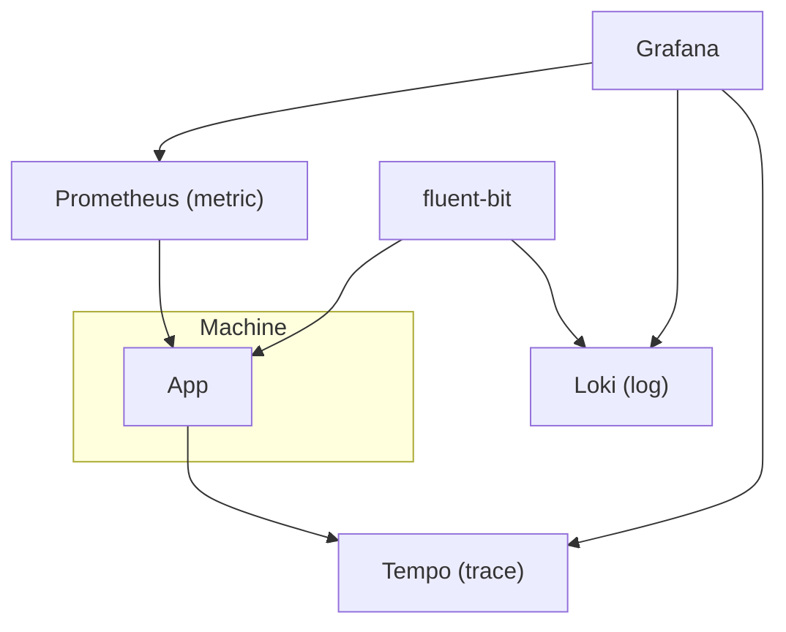

# Overview

## Infrastructure

### Prometheus

### Observability Framework

## Reference

- [使用 Prometheus 和 Grafana 打造 Flask Web App 監控預警系統](https://blog.techbridge.cc/2019/08/26/how-to-use-prometheus-grafana-in-flask-app/)
- [Configure Prometheus Email Alert Notification using Alertmanager](https://computingforgeeks.com/configure-prometheus-email-alert-notification-using-alertmanager/)
- [Grafana Alerting vs AlertManager: A Comparison of Two Leading Monitoring Tools](https://alexandre-vazquez.com/grafana-alerting-vs-alert-manager/)
