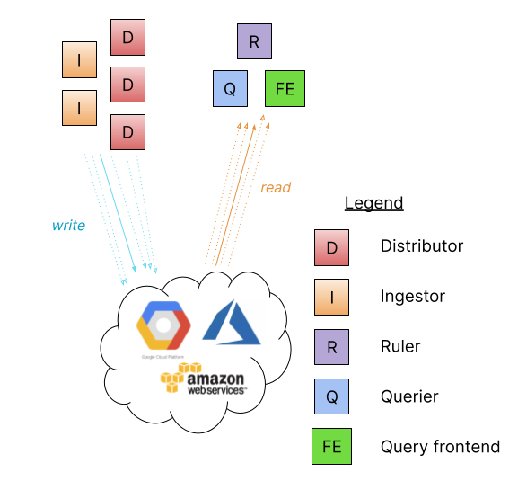

# Grafana Loki

## Deployment Mode

### Monolithic Mode

### Simple Scalable Mode

### Microservice Mode

## LogQL - the Loki query language

### Label matching operators

| Operator | Action             |
| -------- | ------------------ |
| \=       | exactly equal      |
| !=       | not equal          |
| \=~      | regex-match        |
| !~       | do not regex-match |

### Line filtering operators

| Operator | Action                                 |
| -------- | -------------------------------------- |
| \|=      | line contains string                   |
| !=       | line does not contain string           |
| \|~      | line matches regular expression        |
| !~       | line does not match regular expression |

### Improving Query Performance

1. 使用 log label 選定 log stream
2. 使用 line filter
   - 盡量避免用 regex filters (`|~`, `!~`)
3. 使用 parser
   - 支援的 parser 中，解析速度是 pattern > logfmt > JSON > regex

### Demo

## Reference

- [Grafana Loki - Understand labels](https://grafana.com/docs/loki/latest/get-started/labels/)
- [Grafana Loki - Log queries](https://grafana.com/docs/loki/latest/query/log_queries/)
- [Watch: 5 tips for improving Grafana Loki query performance](https://grafana.com/blog/2023/01/10/watch-5-tips-for-improving-grafana-loki-query-performance/)
