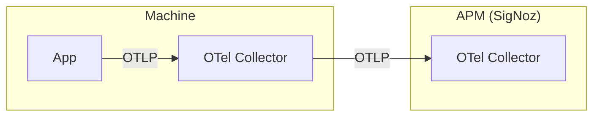

# Overview

## Infrastructure

## SigNoz 安裝步驟

### 1. [Install SigNoz Using Docker Compose](https://signoz.io/docs/install/docker/#install-signoz-using-docker-compose)

!!!info

      The `docker-compose.yaml` installs a sample application named [HotR.O.D](https://github.com/jaegertracing/jaeger/tree/master/examples/hotrod) that generates tracing data. You can explore the SigNoz dashboard with the data provided by the sample application. If you wish to remove the sample application, follow the steps in the [Remove the Sample Application](https://signoz.io/docs/operate/docker-standalone/#remove-the-sample-application) section.

### 2. Verify the Installation

Wait for all the containers to be in running state, and then point your browser to `http://<IP-ADDRESS>:3301/` to access the dashboard, replacing `<IP-ADDRESS>` with the IP address of the machine where you installed SigNoz.
